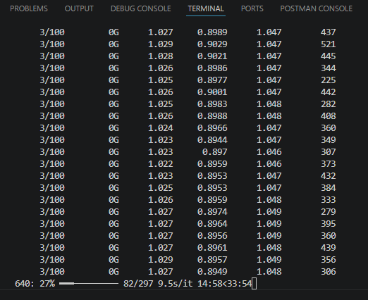

# Resumo do Desenvolvimento — RiftShield

## MVP desenvolvido durante o Hackathon

---

## O que já foi feito

### Backend (FastAPI + Python)

| Área | O que foi implementado |
|---|---|
| **Infraestrutura** | Docker Compose com backend (FastAPI), frontend (React/Vite) e MongoDB 7 |
| **Autenticação** | Sistema completo de registro/login com JWT (access token + refresh token) |
| **Convite** | Sistema de **código de convite de uso único** — gera token aleatório (`secrets.token_hex(16)`), armazena no MongoDB com papel (role), valida no registro, marca como usado após cadastro. Inválido se já utilizado. |
| **Refresh Automático** | Endpoint `POST /api/auth/refresh` que renova o access token + refresh token silenciosamente |
| **Logout** | Endpoint que invalida o refresh token no banco |
| **Base de Conhecimento (KB)** | Modelos `KBVulnerability` e `KBCountermeasure` com seed automática via STRIDE |
| **Inferência YOLO** | Endpoints para analisar imagens com YOLO (`POST /api/inference/analyze`) |
| **Análise de Ameaças** | Endpoint `POST /api/inference/analyze-threat` que gera relatório de ameaças a partir da inferência |
| **Relatórios de Ameaça** | CRUD de relatórios de ameaça (`GET /api/inference/threats`, `GET /api/inference/threats/{id}`) |
| **Dashboard** | Endpoint `GET /api/dashboard/stats` com KPIs e métricas |
| **Dataset** | Upload de imagens, listagem, deleção, aumento de dados (augmentation), estatísticas |
| **Treinamento YOLO** | Pipeline de treinamento, listagem de modelos, ativação de versão |
| **Knowledge Base** | Listagem de vulnerabilidades (pesquisável) e contramedidas |
| **Testes** | Testes unitários/integração para Dashboard, Dataset, Inference, KB e Training |

### Frontend (React + TypeScript + Chakra UI)

| Área | O que foi implementado |
|---|---|
| **Autenticação** | Tela de Login/Registro com validação de formulário |
| **Registro** | Formulário com campos: Nome (obrigatório), Email (obrigatório), Senha (obrigatório), Código de Convite (obrigatório), mais campos opcionais (Contato, País, Estado, Cidade) |
| **Refresh Automático** | Interceptor Axios que enfileira requisições em caso de 401, executa refresh, e retorna todas as chamadas pendentes — sem perder requisições |
| **AuthContext** | Contexto de autenticação que tenta refresh automático ao carregar a página se o token de acesso expirou |
| **Dashboard** | Página inicial com KPIs visuais |
| **Páginas** | Inference, Training, Dataset, Threats, Vulnerabilities, Countermeasures, Profile, Settings |
| **Toast Notification** | Sistema próprio de notificações toast com animações e contexto |
| **Tema** | Toggle claro/escuro com ThemeToggle |
| **Layout** | Navbar, Sidebar, Footer — responsivo |

---

## Fluxo de Modelagem de Ameaças (STRIDE)

1. Usuario faz upload de uma imagem de diagrama de arquitetura
2. **YOLO** detecta os componentes na imagem (ex: usuário, servidor, banco de dados, API, gateway, container)
3. O sistema cruza os componentes detectados com a **Base de Conhecimento STRIDE**
4. Para cada componente, busca **vulnerabilidades associadas** (ex: "SQL Injection" → Database)
5. Para cada vulnerabilidade, busca **contramedidas específicas**
6. Gera um **Relatório de Modelagem de Ameaças** completo
7. Exibe no frontend em ThreatsPage com detalhes

---

## Próximos passos (para finalizar o MVP)

- [ ] Aprimorar o dataset de imagens de arquitetura de software (anotações para YOLO)
- [ ] Melhorar o treinamento do modelo YOLO com o dataset de arquitetura anotado
- [ ] Refinar a acurácia da detecção de componentes (usuário, servidor, banco, API, etc.)
- [ ] Adicionar exportação do relatório de modelagem de ameaças em PDF
- [ ] Pipeline CI/CD automatizado
- [ ] Testes de frontend (Vitest)
- [ ] Subir para produção (deploy)
- [ ] Paginação nas listas de vulnerabilidades e contramedidas
- [ ] Controle de acesso baseado em papéis (RBAC) para endpoints de admin
- [ ] WebSocket para progresso de treinamento em tempo real
- [ ] Edição de perfil de usuário
- [ ] Recuperação de senha
- [ ] Rate limiting em endpoints de autenticação
- [ ] Logging de auditoria para eventos de segurança
- [ ] Vídeo de até 15 minutos explicando a solução
- [ ] Documentação detalhada do fluxo de desenvolvimento

---

> Projeto: **RiftShield** — Hackathon FIAP Software Security
> Autor: **Henrique Bisneto — 2026**
