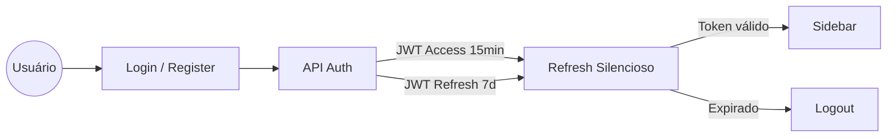
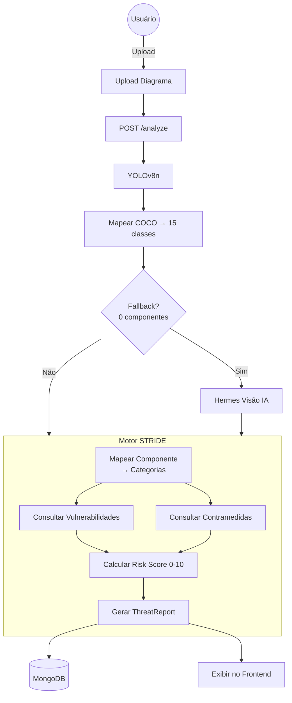
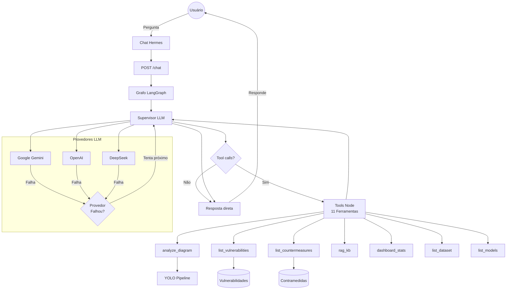
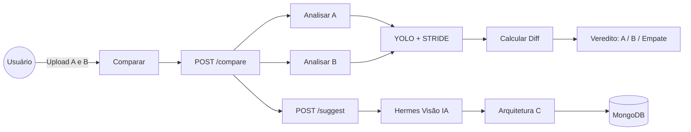
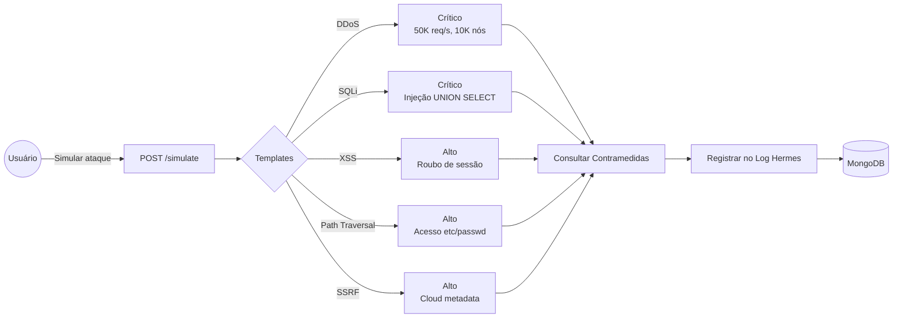
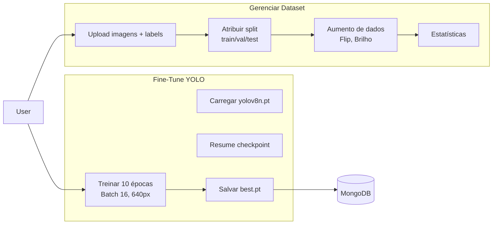
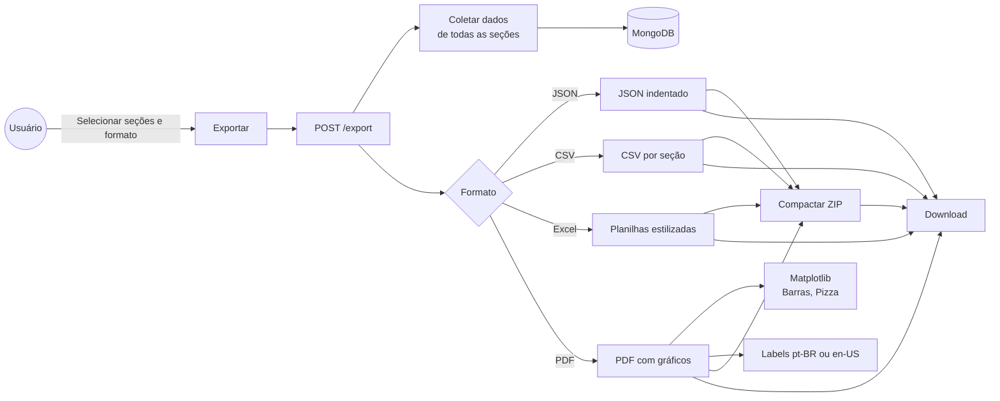
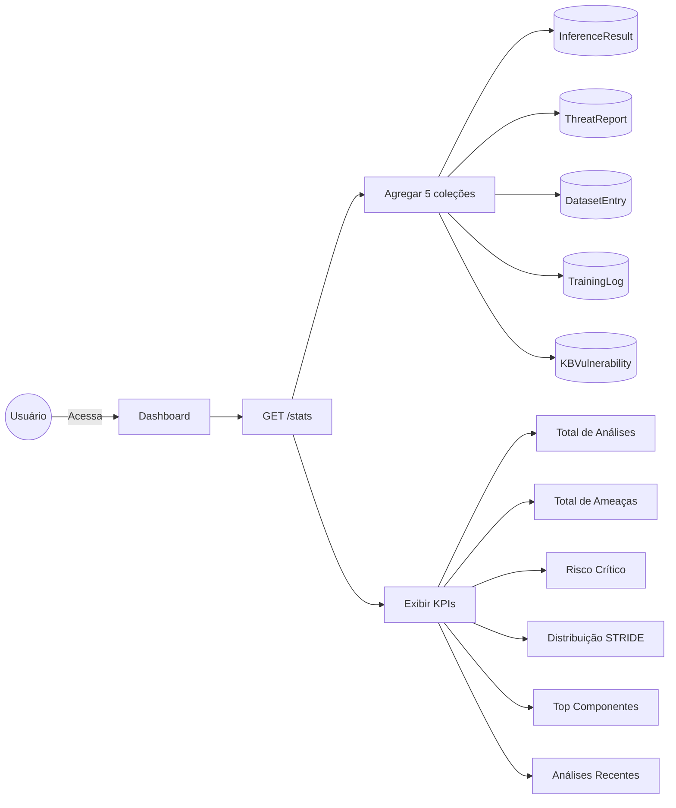

# Fluxo do Sistema — RiftShield

## 1. Autenticação

---

## 2. Análise de Diagramas + STRIDE

---

## 3. Agente Hermes

---

## 4. Comparação de Arquiteturas

---

## 5. Simulação de Ataques

---

## 6. Treinamento + Dataset

---

## 7. Exportação

---

## 8. Dashboard

---

## Legenda

| Cor | Significado |
|-----|-------------|
| 🔵 Azul | Ação do usuário / Frontend |
| 🟠 Laranja | API / Requisição |
| 🟢 Verde | YOLO / Detecção |
| 🟣 Roxo | STRIDE / Ameaças |
| 🟡 Amarelo | Hermes / IA |
| 🟩 Verde-água | MongoDB |
| 🩷 Rosa | Exportação |
| ⚪ Cinza | Base de Conhecimento |
